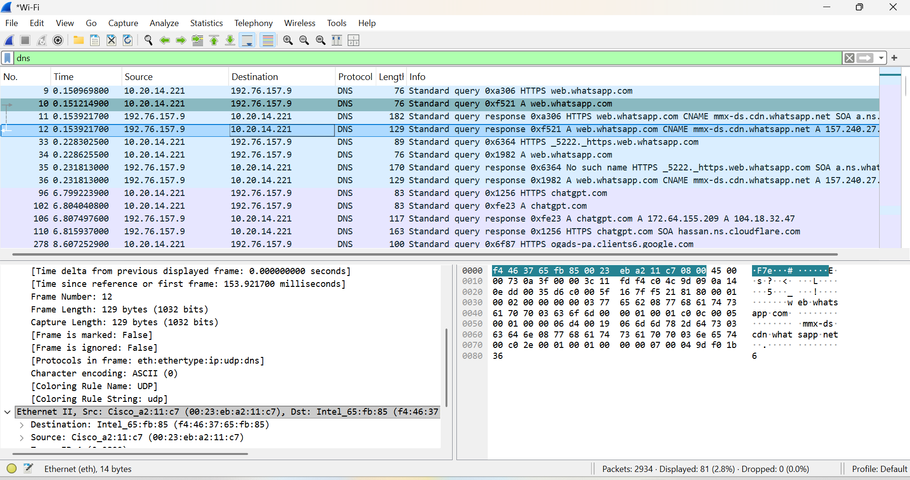
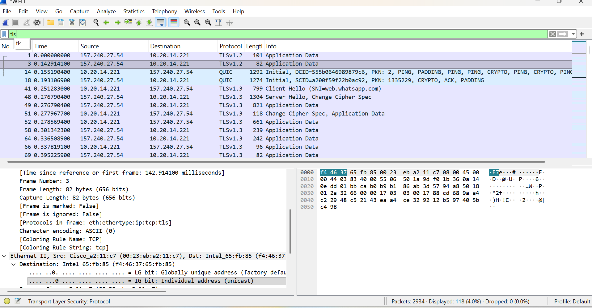

# Wireshark DNS and HTTPS Analysis

## Objective
To capture and analyze network traffic using Wireshark.

## Tools Used
- Wireshark

## Steps Performed
- Started packet capture on Wi-Fi
- Visited websites to generate traffic
- Applied filters (dns, tls)

## Findings
- DNS queries reveal visited domains
- HTTPS traffic is encrypted
- TLS protocol is used for secure communication

## Filters Used
dns
tls

## Screenshots

## Conclusion
Modern web traffic is encrypted using HTTPS, which protects sensitive data.## Why TLS Instead of HTTP?

During analysis, no HTTP traffic was found because most modern websites use HTTPS instead of HTTP.

HTTPS uses TLS (Transport Layer Security) to encrypt communication between the client and server.

In Wireshark:
- HTTP traffic is visible in plaintext
- HTTPS traffic appears as TLS and is encrypted

This is why I used the "tls" filter instead of "http" to analyze secure web traffic.

## Key Learning
Modern network communication is encrypted, making traffic analysis more focused on metadata rather than content.
