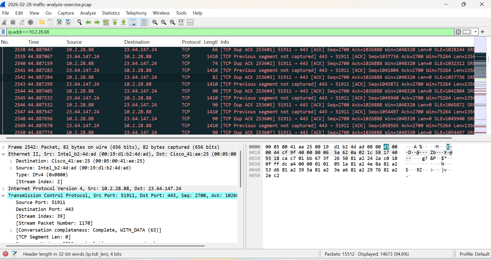
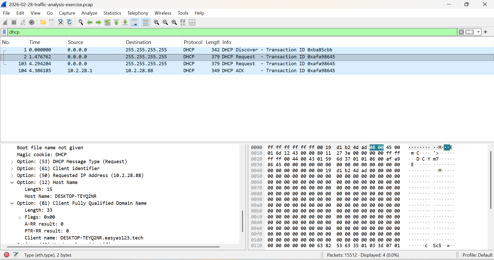

# 🛡️ Infected Host Identification using Wireshark

## 📌 Objective
To analyze network traffic and identify a potentially compromised Windows host along with associated user details.

## 🧪 Scenario
A packet capture (PCAP) file was analyzed to investigate suspicious network activity. The goal was to identify the infected machine and gather relevant system and user information.

## 🛠️ Tools Used
- Wireshark

## 🔍 Investigation Process
- Opened the PCAP file in Wireshark
- Applied filters to isolate relevant traffic
- Analyzed DHCP, TCP, and other protocol data
- Extracted host and user information from packet-level details

## 🖥️ Host Identification Findings

The analysis revealed the following details of the suspected infected system:

- **IP Address:** 10.2.28.88  
- **MAC Address:** 00:19:d1:b2:4d:ad  
- **Hostname:** DESKTOP-TEYQ2NR  
- **User Account:** brolf  
- **Full Name:** Becka Rolf  

## 📊 Key Analysis Insights
- The host was identified through DHCP traffic and packet inspection
- MAC address mapping confirmed the physical device identity
- Hostname was extracted from DHCP Option fields
- User-related information was identified through traffic analysis

## 🚨 Indicators of Suspicion
- Unusual network activity originating from the identified host
- Repeated communication with external IP addresses
- ## 🔎 User Identification Analysis

To identify the user associated with the infected system, deeper inspection of network traffic was performed.

- Applied filters to inspect application-layer protocols such as HTTP and SMB
- Used search functionality to locate user-related strings within packet data
- Followed TCP streams to analyze readable content within network sessions

During analysis, user-related information was identified from packet data:

- **User Account:** brolf  
- **Full Name:** Becka Rolf  

This information was extracted from network communication where user details were transmitted in readable format.

## 🧠 Analysis Technique Used
- Wireshark “Follow TCP Stream” feature  
- Packet content search (Ctrl + F)  
- Inspection of application-layer protocols  

## 🔐 Security Observation
The presence of user information in network traffic indicates potential exposure of sensitive data.  
In real-world environments, such data should be protected using secure encryption protocols.

## 📸 Evidence

## 🌍 Real-World Security Insight
Identifying compromised hosts is a critical step in incident response.

## 🧠 Skills Demonstrated
- Network Traffic Analysis  
- Packet Inspection using Wireshark  
- Host Identification  

## ✅ Conclusion
The analysis successfully identified the infected Windows system and associated user details.

## ⚠️ Analyst Note
The identified system should be isolated for further investigation.

## 📌 Note
This project is based on a practice lab for educational purposes.
