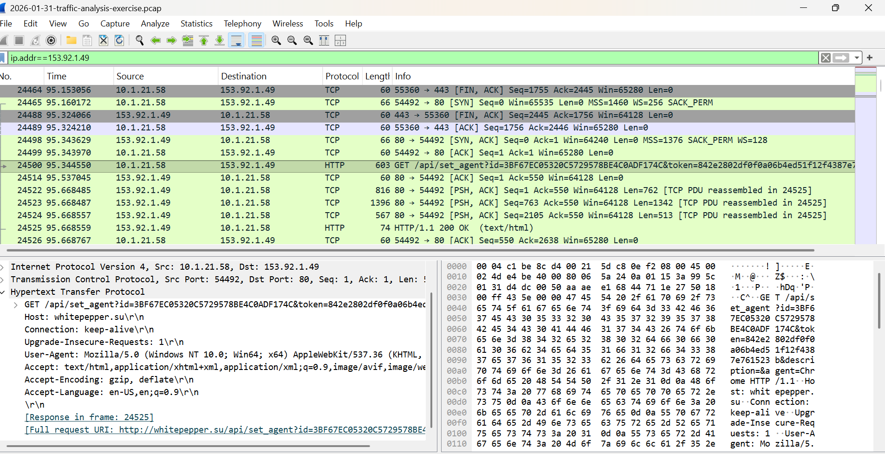

#  Malware Traffic Analysis Report
### *Lumma Stealer Investigation*

---

##  Incident Overview
> A security alert was triggered due to suspicious communication between an internal host and an external IP address (**153.92.1.49**) over TCP port 80.  
> This activity is associated with **Lumma Stealer malware**, a known information-stealing threat.

---

##  Environment Context

| Parameter | Value |
|----------|------|
| Network Range | 10.1.21.0/24 |
| Domain | win10office.com |
| AD Environment | WIN10OFFICE |
| Domain Controller | 10.1.21.12 |
| Gateway | 10.1.21.11 |

---

##  Investigation Approach

**Steps performed:**

- Applied filter:- Analyzed:
- DHCP → Host identification  
- Kerberos → User identification  
- HTTP/TLS → Domain detection  

---

##  Infected Host Details

| Field | Value |
|------|------|
| IP Address | 10.1.21.58 |
| MAC Address | 00:19:d1:b2:4d:ad |
| Hostname | WIN-LU4L24X3UB7 |

---

##  User Details

| Field | Value |
|------|------|
| Username | gwyatt |
| Full Name | Gabriel Wyatt |

---

##  Malicious Communication

The infected host communicated with the external IP:

153.92.1.49

###  Domain Identification

- **Resolved Domain:** your-domain-here.com  

The domain was identified by analyzing TLS handshake traffic and extracting the Server Name Indication (SNI) field.

---

##  Indicators of Compromise (IOC)

- 🔴 Suspicious external IP: `153.92.1.49`
- 🔴 Malicious domain: `your-domain-here.com`
- 🔴 Unusual outbound communication

---

## Evidence

### Host Identification

---

###  Malicious Domain Evidence

---

##  Security Insight

> Lumma Stealer is an information-stealing malware that communicates with external command-and-control (C2) servers.  
> Detecting such communication patterns is critical for identifying compromised systems.

---

## Skills Demonstrated

-  Network Traffic Analysis  
-  Wireshark Packet Inspection  
-  Host & User Identification  
-  Malware Traffic Investigation  
-  Incident Reporting  

---

##  Conclusion

The analysis successfully identified:

-  Infected host  
-  Associated user  
-  Suspicious external communication  

This confirms a potential **malware infection scenario** requiring immediate response.

---

## Recommendations

- Isolate infected system from network  
- Perform malware removal and forensic analysis  
- Reset compromised user credentials  
- Monitor for similar traffic patterns  

---

## Exercise Source

This project is based on a real-world lab from:

https://www.malware-traffic-analysis.net/

---

## Disclaimer

This project is created for educational purposes as part of cybersecurity practice.
