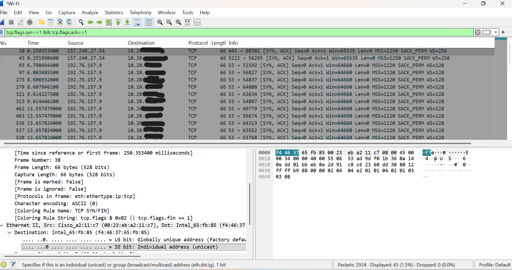

# TCP Handshake Analysis using Wireshark

## Objective
To understand how TCP connections are established using the three-way handshake process.

## Tools Used
- Wireshark

## Steps Performed
- Started packet capture on Wi-Fi
- Generated traffic by visiting websites (example.com)
- Applied TCP filters to isolate handshake packets

## TCP Handshake Explained
The TCP handshake is a three-step process used to establish a reliable connection:

1. SYN (Synchronize)
   - Client sends a request to initiate a connection

2. SYN-ACK (Synchronize-Acknowledge)
   - Server responds with acknowledgment and synchronization

3. ACK (Acknowledge)
   - Client confirms the connection is established

## Findings
- Identified SYN packets where connection starts
- Observed SYN-ACK packets from server response
- Detected ACK packets confirming connection
- Verified source and destination IP addresses

## Filters Used
tcp
tcp.flags.syn == 1

## Screenshots

## Real-World Security Insight
Understanding TCP handshake is important because attackers can exploit this process using techniques like SYN flood attacks.

## Skills Demonstrated
- Network Traffic Analysis
- TCP/IP Fundamentals
- Packet Inspection using Wireshark

## Conclusion
The TCP handshake ensures reliable communication between client and server and is a fundamental concept in networking and cybersecurity.
