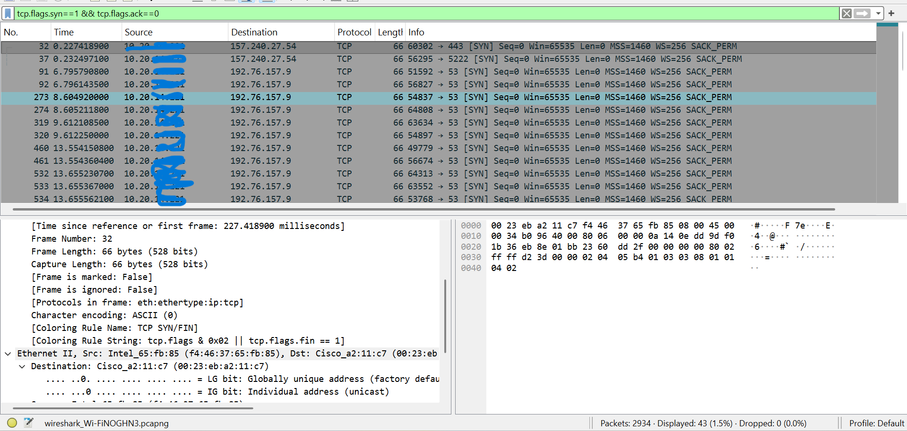
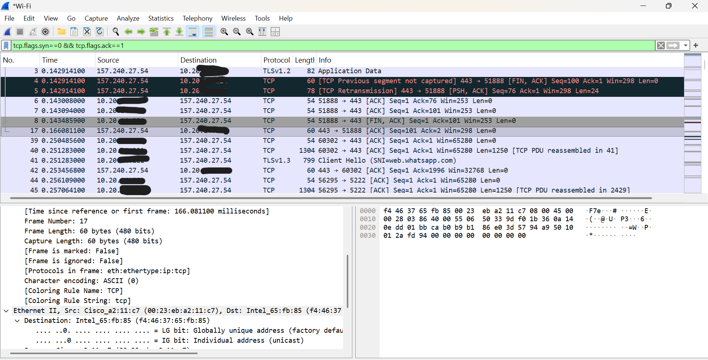

# TCP Handshake Analysis using Wireshark

## Objective
To analyze how TCP connections are established using the three-way handshake process in real network traffic.

## Tools Used
- Wireshark

## Steps Performed
- Started packet capture on Wi-Fi interface
- Generated traffic by visiting a website (example.com)
- Applied TCP filters to isolate handshake packets
- Inspected packet details to identify TCP flags

## TCP Handshake Explained
The TCP three-way handshake is used to establish a reliable connection between a client and a server:

1. SYN (Synchronize)
   - Client initiates connection by sending SYN packet

2. SYN-ACK (Synchronize-Acknowledge)
   - Server responds with SYN and ACK flags set

3. ACK (Acknowledge)
   - Client sends ACK to confirm connection establishment

## Findings
- Observed SYN packets indicating connection initiation
- Identified SYN-ACK packets from server response
- Detected ACK packets completing the handshake
- Verified communication between source and destination systems

## Filters Used
tcp
tcp.flags.syn == 1
tcp.flags.syn == 1 && tcp.flags.ack == 0
tcp.flags.syn == 1 && tcp.flags.ack == 1
tcp.flags.ack == 1 && tcp.flags.syn == 0

## Screenshots

## Real-World Security Insight
The TCP handshake is a critical process in network communication. Attackers can exploit this process using techniques such as SYN flood attacks, where a large number of SYN requests are sent without completing the handshake, causing resource exhaustion on the server.

## Privacy Note
IP addresses in screenshots may be masked to protect privacy and follow security best practices.

## Skills Demonstrated
- Network Traffic Analysis
- TCP/IP Fundamentals
- Packet Inspection using Wireshark
- Understanding of TCP Flags and Handshake Process

## Conclusion
The TCP three-way handshake ensures reliable and ordered communication between client and server. Understanding this process is essential for network troubleshooting and cybersecurity analysis.
